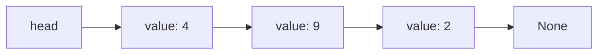
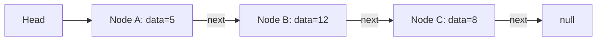
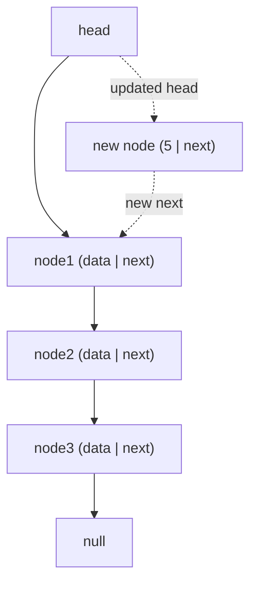

# SPL Run: build_concept_book

- **Adapter:** claude_cli
- **Model:** claude-sonnet-5
- **Tokens:** 4793 in / 3017 out
- **Latency:** 196558ms
- **Timestamp:** 2026-09-27 12:49:06

## Output

```output


---

## Node

A node is the basic storage unit of a linked data structure: it packages a data value together with one or more references (pointers) to other nodes. Unlike an array, where elements sit in contiguous memory and are located by arithmetic on an index, a node can live anywhere in memory — it is connected to the rest of the structure only through its references. This is the key structural trade-off of linked structures versus arrays: nodes give up $O(1)$ random access by position in exchange for $O(1)$ insertion and deletion at a known location, since no other elements need to shift.

**Worked example.** A singly linked list node is typically defined as:

```python
class Node:
    def __init__(self, value, next=None):
        self.value = value   # the data payload
        self.next = next     # reference to the next node, or None
```

A chain of three nodes storing 4, 9, 2 is built by linking each node's `next` reference to the following node:

```python
n3 = Node(2, None)
n2 = Node(9, n3)
n1 = Node(4, n2)
head = n1
```

Traversal starts at `head` and follows `next` references until reaching `None`, which marks the end of the list. Each node here has exactly one reference; a doubly linked list node would carry two (`next` and `prev`), and a binary tree node would carry two child references (`left` and `right`) instead of a single successor.



*A singly linked list: each node stores a value and a reference to the next node, ending in a null reference.*

**Problem-solving application.** Understanding a node's structure is essential for reasoning about algorithm correctness and efficiency. For instance, deleting the node holding value 9 above requires only redirecting `n1.next` to point at `n3` — an $O(1)$ operation once the predecessor node is known — compared to $O(n)$ for shifting elements in an array-based list. Many classic problems (detecting a cycle with Floyd's algorithm, reversing a linked list in place, or balancing a binary search tree) reduce to correctly manipulating node references without losing access to the rest of the structure, since overwriting a reference before saving it elsewhere permanently disconnects the remaining nodes.

---

## Pointer Reference

A pointer reference is a value stored inside a node that does not hold data itself but instead holds the *address* of another node in memory. This indirection is what allows individual, independently allocated pieces of data to be linked into a larger structure — most commonly a sequence, as in a linked list, but the same mechanism underlies trees, graphs, and any dynamic data structure. Formally, if a node $N$ has fields $(\text{data}, \text{next})$, then $\text{next}$ is not a copy of another node but a reference $\text{next} = \&M$, where $M$ is some other node's memory location. Following $N.\text{next}$ is called *dereferencing*, and it is the operation that lets a program traverse from one node to the next without knowing in advance how many nodes exist or where they live in memory.

**Worked example.** Consider a singly linked list built from three nodes holding the values 5, 12, and 8. Node A's `next` field stores the address of Node B; Node B's `next` field stores the address of Node C; Node C's `next` field stores a special value, `null` (or `None`), signaling "no further node." Traversal starts at a `head` pointer referencing Node A, then repeatedly dereferences `next` until it reaches `null`:

```python
current = head
while current is not None:
    print(current.data)
    current = current.next
```

Each iteration overwrites `current` with the pointer stored in the node just visited — the pointer *is* the instruction for where to go next.

**Problem-solving application.** Pointer references make insertion and deletion $O(1)$ at a known position, because only the neighboring pointers need to be rewritten — no shifting of elements, unlike an array. For example, inserting a new node $X$ between A and B requires only two pointer updates: $A.\text{next} \leftarrow X$ and $X.\text{next} \leftarrow B$'s old target. This efficiency comes at the cost of losing constant-time random access, since reaching the $k$-th node requires $k$ dereferences, $O(k)$. Recognizing this trade-off — pointer-based structures favor cheap local modification over cheap indexed lookup — is the key decision point when choosing between array-based and pointer-based (node-based) data structures for a given algorithm.



*Each node's `next` field is a pointer reference to the following node, chaining independent nodes into a single traversable sequence.*

---

## Sllist

A singly linked list (SLList) is a linear data structure composed of nodes, where each node holds a data value and a pointer (reference) to the next node in the sequence. Unlike an array, an SLList does not store its elements in contiguous memory; instead, each node is allocated independently, and the chain of `next` references is what defines the order. A `head` reference marks the first node, and a `tail` reference (optional but common) marks the last node, whose `next` pointer is `null`, signaling the end of the list.

This structure matters because it trades away array's $O(1)$ random access for two things arrays cannot offer cheaply: $O(1)$ insertion at the front, and a size that grows without needing to reallocate and copy the entire structure. Understanding when these trade-offs favor a linked list is the core problem-solving skill.

**Worked example — adding a node at the head.** Suppose the list currently holds $3 \rightarrow 7 \rightarrow 12$, with `head` pointing to the node containing 3. To insert a new value 5 at the front:

```python
class Node:
    def __init__(self, data, next=None):
        self.data = data
        self.next = next

def add_first(head, value):
    new_node = Node(value, next=head)   # step 1: link new node to old head
    return new_node                     # step 2: new node becomes head
```

Note the order: the new node's `next` must be set *before* `head` is reassigned, otherwise the reference to the rest of the list is lost. This two-step sequence — link, then repoint — is the pattern behind nearly every SLList mutation (insertion, deletion, reversal).

**Complexity.** Because there is no index into memory, inserting at the head is $O(1)$: only one pointer changes. However, accessing the $k$-th element or inserting at an arbitrary position requires walking the chain from `head`, costing $O(n)$ in the worst case. This asymmetry — cheap at the front, expensive elsewhere — is why SLLists are the natural choice for stacks and job queues, but a poor choice when frequent random access is needed.


*Adding a node at the front: the new node's `next` first points to the current head, then the `head` reference is updated to point to the new node.*

---

## Stack Operations Sllist

A stack is an abstract data type that supports two operations: `push(x)`, which inserts an element, and `pop()`, which removes and returns the most recently inserted element still in the structure — the Last-In-First-Out (LIFO) discipline. A singly linked list (SLList), which maintains a pointer `head` to its first node, is a natural implementation as long as both operations are restricted to the head end of the list.

The key structural fact is that inserting or removing at the head of an SLList requires no traversal. To `push(x)`, allocate a new node `u` with `u.value = x` and `u.next = head`, then set `head = u`. To `pop()`, save `head.value`, set `head = head.next`, and return the saved value. Each operation touches a fixed number of pointers regardless of how many elements the list holds, so both run in $O(1)$ time. Contrast this with inserting or removing at the *tail* of a singly linked list, which requires walking the entire list to find the second-to-last node — an $O(n)$ operation, since a singly linked list has no backward pointer to jump directly to the predecessor of the tail.

Worked example: start with an empty stack (`head = null`). `push(3)` creates node `[3|·]` and sets `head` to it. `push(7)` creates `[7|·]` pointing to `[3|·]`, and `head` moves to the new node. `push(1)` similarly places `1` at the front: the list is now `1 → 7 → 3`. Calling `pop()` returns `1` and advances `head` to the node holding `7`; a second `pop()` returns `7`, leaving just `3`. Notice the output order (`1, 7, 3`) is exactly the reverse of insertion order (`3, 7, 1`) — the defining signature of LIFO behavior.

This design matters in practice: an SLList-backed stack never needs to shift elements (unlike an array-based stack that grows past its capacity) and never wastes time searching, because every operation is anchored at `head`. When solving problems — reversing a sequence, checking balanced parentheses, implementing undo functionality, or evaluating postfix expressions — recognize that any structure needing constant-time "insert/remove most recent" behavior can be implemented directly with this head-only SLList pattern, with correctness following from the invariant that `head` always points to the node inserted most recently among those not yet popped.

---

## Payoff

Implementing a stack over a singly linked list closes the loop between two ideas the course has built separately: the abstract LIFO (last-in-first-out) contract, and the linked list as a dynamic, pointer-based memory structure. The payoff is a stack whose `push` and `pop` operations are both $O(1)$ in the worst case, with no amortized analysis required — unlike an array-backed stack, there is no resizing step, because each node is allocated exactly when needed and freed exactly when popped. Formally, if `top` always points to the most recently pushed node, and every `push(x)` creates a new node $n$ with $n.\text{data} = x$, $n.\text{next} = \text{top}$, then sets $\text{top} = n$, the LIFO invariant is preserved by induction: it holds trivially for an empty stack, and each push/pop pair maintains it by construction. This is the natural endpoint of the concept-book's data-structures arc because it demonstrates that an abstract interface (stack) can be realized on top of a more primitive structure (linked list) without sacrificing asymptotic performance — the same lesson that later justifies building queues, deques, and even hash-table buckets on linked nodes.

Consider a worked example: evaluating a fully parenthesized arithmetic expression, `(3 + (4 * 5))`. A stack-over-sllist processes tokens left to right, pushing operands and operators onto the linked stack, and popping two operands plus an operator whenever a closing parenthesis is seen, replacing them with the computed result pushed back on top. Because each push/pop touches only the `top` pointer and one node, the entire evaluation runs in $O(n)$ time for $n$ tokens — no better and no worse than an array-based stack, but with memory allocated incrementally rather than pre-reserved.

This same mechanism underlies applications far beyond arithmetic: undo/redo history in editors, backtracking search in mazes and puzzles, syntax and balanced-bracket checking in compilers, and the call stack that every recursive function relies on. In each case, the linked-list stack's freedom from fixed capacity is precisely what makes it robust under unpredictable depth. From here, the natural next step is to explore how a call stack implemented this way governs recursive function execution — trace how each recursive call pushes a new activation record, and how deep recursion without a base case manifests as stack overflow.
```
