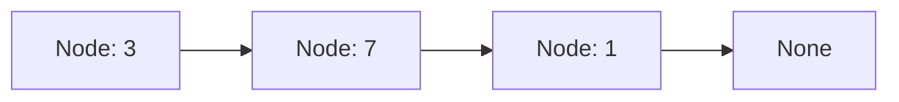
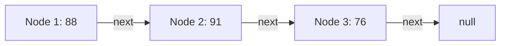
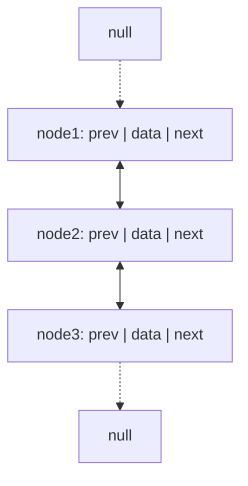
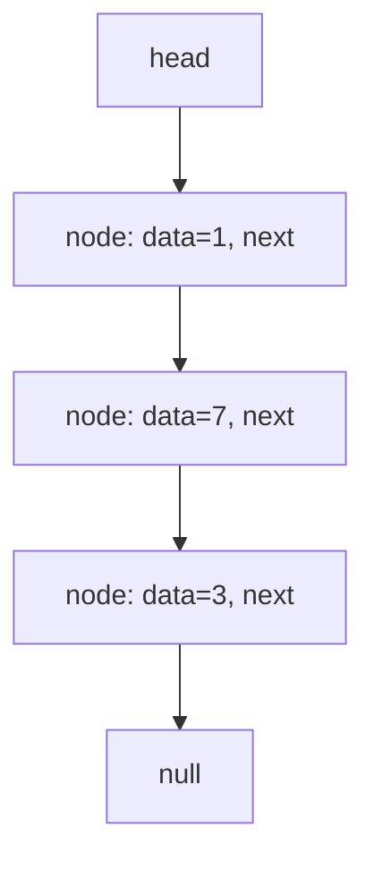

# SPL Run: build_concept_book

- **Adapter:** claude_cli
- **Model:** claude-sonnet-5
- **Tokens:** 5872 in / 3716 out
- **Latency:** 92136ms
- **Timestamp:** 2026-09-27 12:52:23

## Output

```output


---

## Node

A node is the basic unit of a linked data structure: a container holding a data value together with one or more references (pointers) to other nodes. Where an array stores elements in contiguous memory and locates them by arithmetic on an index, a linked structure stores elements wherever memory happens to be available and locates them by following references from node to node. This trade-off — giving up constant-time random access in exchange for constant-time insertion and deletion at any point — is the reason nodes and pointer-based structures exist at all.

The simplest form is the singly linked node, defined recursively:

```python
class Node:
    def __init__(self, value, next=None):
        self.value = value   # data payload
        self.next = next     # reference to the next Node, or None
```

A `next` value of `None` marks the end of the chain. A doubly linked node adds a second reference, `prev`, enabling traversal in both directions; a tree node instead holds multiple child references (`left`/`right` for a binary tree, or a list of children for a general tree); a graph node holds an arbitrary set of neighbor references. In every case the defining feature is the same: a node bundles data with the *connective tissue* that lets the structure be traversed without an index.

**Worked example.** Suppose you build a singly linked list to represent the sequence `3 → 7 → 1`:

```python
n3 = Node(1)
n2 = Node(7, n3)
n1 = Node(3, n2)
```

To find the sum of all values, you cannot use a `for i in range(len(list))` loop, because there is no length field and no direct indexing. Instead you traverse by following references until you reach `None`:

```python
def sum_list(head):
    total = 0
    while head is not None:
        total += head.value
        head = head.next
    return total
```

**Problem-solving application.** Many classic pointer problems reduce to reasoning carefully about node references rather than data values — for example, detecting a cycle (Floyd's algorithm, using slow and fast pointers), reversing a list in place by redirecting each `next` pointer, or deleting a node given only a reference to it (by copying the next node's value and value and skipping over it). In each case, the skill being tested is not arithmetic but precise, defensive manipulation of references: always check for `None` before dereferencing, and always decide whether you are updating a node's *data* or its *link* before writing code.



*A singly linked list: each node holds a value and a reference to the next node, terminating in a null reference.*

---

## Pointer Reference

A pointer reference is a value stored inside a node that identifies the memory location of another node, rather than holding data itself. In a linked data structure, each node is a small package containing (1) a payload — the actual data — and (2) a reference field that stores the address of the next node in the sequence. This address is not the data; it is a *link* that lets the program jump from one node to another without the nodes needing to sit next to each other in memory.

This distinction matters because it separates *logical order* from *physical order*. An array stores elements contiguously, so element $i+1$ is always at address $\text{base} + (i+1)\times \text{size}$ — position determines order. A linked list has no such guarantee: node $A$ might live at memory address 1000 and node $B$ at address 5000, yet $A$ still "comes before" $B$ if $A$'s pointer field stores the value 5000. The sequence exists only because of these stored addresses, not because of physical placement.

Worked example: consider a singly linked list holding exam scores 88, 91, 76. Each node is a pair (score, next). The list is built as:

$$
\text{node}_3 = (76, \text{null}), \quad
\text{node}_2 = (91, \&\text{node}_3), \quad
\text{node}_1 = (88, \&\text{node}_2)
$$

Here $\&\text{node}_3$ denotes "the address of node 3." To traverse the list and print every score, a program starts at $\text{node}_1$, prints its data, then follows its pointer to $\text{node}_2$, and repeats until it reaches a node whose pointer is null — the universal signal for "end of sequence."

Problem-solving application: pointer references let you insert or delete an element in constant time $O(1)$ once you have located the position, because you only rewrite a few address values — no shifting of other elements is required, unlike in an array where inserting at the front costs $O(n)$. For example, to insert a new score 95 between node 1 and node 2, you create $\text{node}_x = (95, \&\text{node}_2)$ and then update node 1's pointer to $\&\text{node}_x$. The rest of the list is untouched. This trade-off — fast insertion/deletion versus slower indexed access, since reaching the $k$-th node requires following $k$ pointers one at a time — is the central design tension you must weigh whenever choosing between array-based and pointer-based structures.


*Each node's pointer field stores the address of the following node, chaining them into a sequence that ends at a null reference.*

---

## Dllist

A doubly linked list (dllist) is a linear data structure in which each node stores three components: a data value, a reference (`next`) to the following node, and a reference (`prev`) to the preceding node. This bidirectional linking is the key structural difference from a singly linked list, where each node only points forward. The tradeoff is memory: each node carries one extra pointer, but in exchange the list supports traversal in either direction and, critically, deletion or insertion at a known node in $O(1)$ time — no need to walk from the head to find the predecessor, since `prev` already points to it.

**Worked example.** Suppose we maintain a dllist representing a browser's history: `Home ↔ Search ↔ ArticleA ↔ ArticleB`. Each node's `next` lets us model "forward" navigation, while `prev` lets us model "back" navigation, without re-scanning the list. To delete `ArticleA` (say the page was removed), we do not need to search for its predecessor:

```
node = ArticleA
node.prev.next = node.next       # Search now points to ArticleB
node.next.prev = node.prev       # ArticleB now points back to Search
```

Both updates run in constant time because `node.prev` and `node.next` are already stored — this is the entire practical advantage of doubling the links.

**Problem-solving application.** Consider designing an LRU (Least Recently Used) cache, a classic interview and systems-design problem. It requires: (1) $O(1)$ access to any element, and (2) $O(1)$ removal of an arbitrary element and re-insertion at the "most recently used" end. A singly linked list fails requirement (2), because removing a node requires scanning from the head to find its predecessor — an $O(n)$ operation. A dllist solves this directly: pair it with a hash map from keys to node references, and any node can be unlinked and moved to the front in $O(1)$, since both its neighbors are immediately known. This combination (hash map + dllist) is the standard implementation pattern for LRU caches in real systems, including Python's `collections.OrderedDict` internals and Java's `LinkedHashMap`.


*A doubly linked list: each node holds both `prev` and `next` references, allowing traversal in both directions — unlike a singly linked list, which only links forward.*

---

## Sllist

A singly linked list (`sllist`) is a data structure that stores a sequence of elements as a chain of nodes. Each node holds two fields: a data value and a reference (pointer) to the next node in the chain. A `head` pointer tracks the first node, and often a `tail` pointer tracks the last node so that appending to the end doesn't require traversing the whole list. The final node's `next` reference is `null`, marking the end of the sequence.

Unlike an array, a linked list does not store elements in contiguous memory, so there is no notion of an "index" you can jump to directly — reaching the $k$-th node requires walking $k$ steps from `head`. This trade-off defines the structure's complexity profile: insertion or deletion at the front is $O(1)$, because it only requires rewiring a constant number of pointers, while access or search by position is $O(n)$ in the worst case, since it may require traversing the entire list.

**Worked example.** Suppose we build a list by repeatedly inserting at the head — a common pattern called `push_front`. Starting from an empty list (`head = null`), inserting values 3, 7, 1 in that order proceeds as follows: create a node for 3, set its `next` to the current `head` (`null`), then update `head` to point to this new node. Repeat for 7: its `next` points to the node holding 3, and `head` now points to 7. Repeat for 1: its `next` points to 7, and `head` now points to 1. The resulting list, read from `head`, is $1 \to 7 \to 3 \to \text{null}$ — the reverse of insertion order, since each new node displaces the previous head.

**Problem-solving application.** A frequent interview-style task is reversing a linked list in place, using only $O(1)$ extra space. The technique mirrors the insertion logic above: walk the list while maintaining three pointers — `prev` (initially `null`), `curr` (initially `head`), and a temporary `next_node`. At each step, save `curr.next` into `next_node`, redirect `curr.next` to `prev`, then advance `prev` to `curr` and `curr` to `next_node`. After the loop terminates, `prev` becomes the new head. This runs in $O(n)$ time and $O(1)$ space, in contrast to an array reversal, which also runs in $O(n)$ time but benefits from index-based swapping rather than pointer rewiring.


*A singly linked list after three head-insertions (3, then 7, then 1); each new node's `next` points to the prior head before `head` is reassigned.*

---

## Queue Operations Sllist

A queue is a **FIFO** (first-in, first-out) structure: the element that has been waiting longest is the one removed next, like a line at a checkout counter. Implementing a queue with a singly linked list (SLList) requires choosing the operations carefully — the wrong choice turns an $O(1)$ operation into an $O(n)$ one.

An SLList maintains a `head` pointer (start of the list) and, in efficient implementations, a `tail` pointer (end of the list). Because each node stores a pointer only to its *next* neighbor (not its previous one), the list is cheap to modify at the head, and cheap at the tail *only if* a tail pointer is kept. This asymmetry dictates the queue design:

- **`add(x)`** inserts at the **tail**: create a new node, link `tail.next` to it, then update `tail` to point to the new node. No traversal needed — $O(1)$.
- **`remove()`** deletes at the **head**: read the value stored at `head`, then advance `head` to `head.next`. Again, no traversal — $O(1)$.

**Worked example.** Start with an empty queue (`head = tail = null`). Call `add(5)`: a node `[5]` is created; `head` and `tail` both point to it. Call `add(9)`: a new node `[9]` is linked after `[5]`; `tail` moves to `[9]`, while `head` still points to `[5]`. Call `add(2)`: `[2]` is linked after `[9]`; `tail` moves to `[2]`. The list is now `5 → 9 → 2`. Calling `remove()` returns `5` (the value at `head`) and moves `head` to the node holding `9`. The queue is now `9 → 2`, correctly preserving arrival order.

**Why not the reverse mapping?** If `add(x)` inserted at the head and `remove()` deleted from the tail, both operations would still need to locate the tail's *predecessor* to fix the link after deletion — but a singly linked list has no backward pointers, forcing an $O(n)$ traversal from `head` every time. Pairing "add at tail, remove at head" with an explicit `tail` pointer is the only combination that keeps both operations at $O(1)$; this is precisely the same design principle used in production data structures like Java's `ArrayDeque`-backed queues or kernel scheduler run-queues, where every microsecond of enqueue/dequeue latency matters.

---

## Payoff

A queue built on a singly linked list achieves something an array-based queue cannot deliver without cost: true $O(1)$ enqueue and dequeue, every time, regardless of how many elements the queue holds. By maintaining two pointers — `head` for dequeuing and `tail` for enqueuing — the structure avoids the hidden penalty of shifting elements or resizing a backing array. Enqueue appends a node after `tail` and updates the pointer; dequeue detaches the node at `head` and advances it. Neither operation touches any other node, so the running time is independent of queue size: $T_{\text{enqueue}}(n) = T_{\text{dequeue}}(n) = O(1)$. This is the natural endpoint of the chapter because it is where every earlier skill converges — node allocation, pointer reassignment, and the discipline of maintaining two synchronized invariants (a live `head` and a live `tail`) rather than just one, as a plain linked list requires.

Consider a worked example: simulate order processing at a coffee shop. Each incoming order enqueues at `tail`; the barista dequeues from `head` and serves strictly in arrival order — first-in, first-out (FIFO). If ten orders arrive during a rush, insertion cost stays flat at $O(1)$ per order, not the $O(n)$ per-insertion cost that occurs when a fixed-size array queue must shift or resize. That flatness is precisely why every FIFO-dependent system — task schedulers, print spoolers, message brokers, and buffered I/O streams — is built on this pattern rather than on an array.

The queue's real payoff, though, is as an engine for graph and tree traversal. Breadth-first search (BFS) is nothing more than a queue-driven loop: enqueue a starting node, then repeatedly dequeue a node, enqueue its unvisited neighbors, and continue until the queue empties. The queue's FIFO discipline is exactly what forces BFS to explore level by level rather than plunging down one path, which is what guarantees BFS finds the shortest path in an unweighted graph.

As your next step, trace a queue-operations-sllist implementation through a full BFS on a small graph — enqueue the root, dequeue and expand each node's neighbors, and watch how the queue's contents at each step correspond exactly to one "frontier" of the search. That single exercise reveals why this simple structure sits underneath so much of computer science.
```
